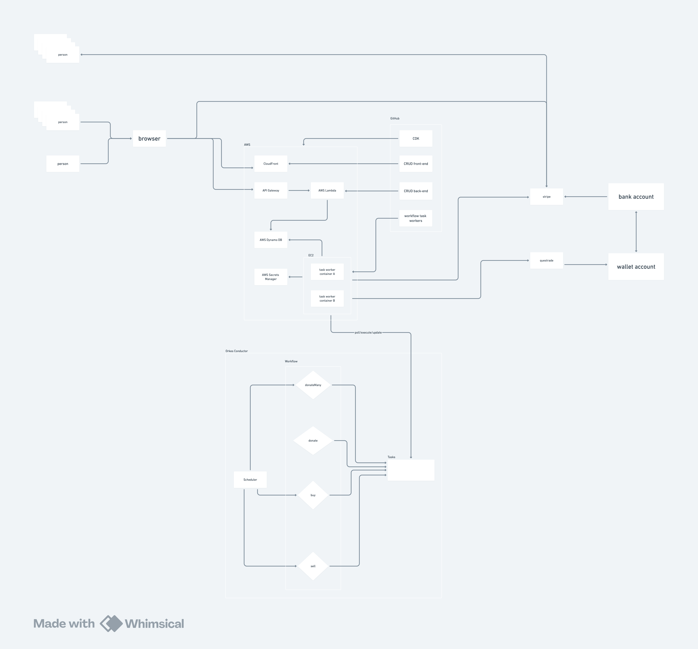

# red-brick

An automated investment fund designed to provide universal basic income through compound growth.

## The Concept

**Red-brick** is a community-funded investment pool that grows over decades to eventually provide monthly basic income to participants. The system works on a simple principle: **invest contributions, distribute returns sustainably**.

## How It Works

- **Contributors** add money to build the fund
- **Fund managers** invest in diversified portfolios (targeting 7% annual returns)
- **Recipients** receive monthly payments once the fund reaches sufficient size
- **Sustainability** is maintained by paying out less than the fund generates

The key insight: *As long as annual distributions stay below investment returns, the fund grows indefinitely while supporting more people each year.*

## Vision & Scale

Starting with $1M and 7% annual returns, the fund could theoretically grow to support:

| Timeframe | Fund Size | People Supported | Monthly Payment |
| --------- | --------- | ---------------- | --------------- |
| Year 25   | $6.5M     | 18               | $1,900          |
| Year 100  | $500M     | 800              | $3,000          |
| Year 200  | $45B      | 60,000           | $3,000          |
| Year 300  | $800B     | 1,200,000        | $3,000          |

## Phase 1: Establish proof of concept (First 25 years)

| Year | Fund Balance | Annual Return | People | Monthly/Person | Total Annual Out | Net Growth |
| ---- | ------------ | ------------- | ------ | -------------- | ---------------- | ---------- |
| 1    | $1M          | $70K          | 0      | $0             | $0               | +$70K      |
| 5    | $1.4M        | $98K          | 3      | $1,500         | $54K             | +$44K      |
| 10   | $2.0M        | $140K         | 6      | $1,600         | $115K            | +$25K      |
| 15   | $2.8M        | $196K         | 8      | $1,700         | $163K            | +$33K      |
| 20   | $4.2M        | $294K         | 12     | $1,800         | $259K            | +$35K      |
| 25   | $6.5M        | $455K         | 18     | $1,900         | $410K            | +$45K      |

## Phase 2: Support neighborhoods (Years 25-100)

| Year | Fund Balance | Annual Return | People | Monthly/Person | Total Annual Out | Contributions per year | Net Growth |
| ---- | ------------ | ------------- | ------ | -------------- | ---------------- | ---------------------- | ---------- |
| 30   | $10M         | $700K         | 25     | $2,000         | $600K            | $50K                   | +$150K     |
| 40   | $18M         | $1.26M        | 40     | $2,200         | $1.06M           | $100K                  | +$300K     |
| 50   | $35M         | $2.45M        | 70     | $2,400         | $2.02M           | $200K                  | +$630K     |
| 60   | $70M         | $4.9M         | 130    | $2,600         | $4.06M           | $500K                  | +$1.34M    |
| 75   | $150M        | $10.5M        | 250    | $2,800         | $8.4M            | $1M                    | +$3.1M     |
| 100  | $500M        | $35M          | 800    | $3,000         | $28.8M           | $10M                   | +$16.2M    |

## Phase 3: Support significant populations

| Year | Fund Balance | Annual Return | People    | Monthly/Person | Total Annual Out | Contributions per year | Net Growth |
| ---- | ------------ | ------------- | --------- | -------------- | ---------------- | ---------------------- | ---------- |
| 125  | $1.5B        | $105M         | 2,200     | $3,000         | $79.2M           | $30M                   | +$55.8M    |
| 150  | $5B          | $350M         | 7,000     | $3,000         | $252M            | $100M                  | +$198M     |
| 175  | $15B         | $1.05B        | 20,000    | $3,000         | $720M            | $300M                  | +$630M     |
| 200  | $45B         | $3.15B        | 60,000    | $3,000         | $2.16B           | $1B                    | +$1.99B    |
| 250  | $200B        | $14B          | 300,000   | $3,000         | $10.8B           | $5B                    | +$8.2B     |
| 300  | $800B        | $56B          | 1,200,000 | $3,000         | $43.2B           | $20B                   | +$32.8B    |

## System design:

